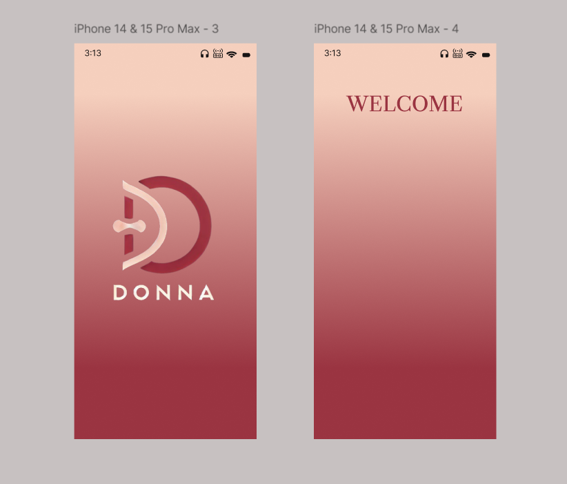

# DONNA 🎯

## Basic Details
### Team Name: Donna

 
### Team Members
- Member 1: **Malavika Krishnan - Amal Jyothi College of engineering**
- Member 2: **Donamol Joseph - Amal Jyothi College of engineering**
- Member 3: **Jinsa Mariam Thomas - Amal Jyothi College of engineering**

### Hosted Project Link
https://we-make-simple.netlify.app/h.html

### Project Description
The app developed under this project manually inputted into the database, then it stores this information to notify users a couple of days before the products' expiration. The idea of this application is to help decrease waste, maintain order, and provide the utmost convenience to its users.

### The Problem statement
The expiry of most packaged food products and other commodities remains unnoticed, resulting in wastage, loss of money, and health hazards. Lack of tracking, disorganization, and misinterpretation of expiry labels contribute to this issue and therefore necessitate an efficient expiry management solution.

### The Solution
The app helps in giving the notification and helps the buyers to know when the food/product is getting expired and use it without wastage. 

## Technical Details
### Technologies/Components Used
For Software:
- [Languages used]-HTML,CSS,Javascript
- [Frameworks used]-Node.js
- [Libraries used]-json,cv2,
- [Tools used]-UI/UX,git,pip,VScode

### Implementation
The Donna App is built using HTML, CSS, and JavaScript to track product expiry dates and notify users before expiration.
1. User Interface (UI) - (index.html, style.css)
Form Input: Users enter product name, manufacturing date, and expiry date.
Product List: Displays added products with expiry details.

3. Functionality & Logic - (script.js)
Local Storage: Stores product details in the browser.
Expiry Tracking:
Removes expired products automatically.
Highlights soon-to-expire items.
Notification System:
Popups alert users before expiry (up to 3 times, every 6 hours).
Delete Option: Users can remove items manually.

4. Technology Stack
Frontend: HTML, CSS
Backend Logic: JavaScript
Storage: LocalStorage for offline data persistence

# Installation
Git
VS CODE

# Run
HTML
CSS
JS

### Project Documentation
For Software:
git clone https://github.com/Malavika-Krishnan/Donna.git
open h.html with live server

# Screenshots:
[Entry_Page](Entry_page.png)
This is a clean and simple entry (or splash) page design featuring a logo, a brand name, and a call-to-action button.

[Main_Page](main_page.png)
This is a clean and functional design for a product expiry tracking application's main page. Let's analyze its elements and discuss its potential effectiveness:

Elements:
Container: The rounded rectangle container provides a clear boundary for the app's content, separating it from the background.

Input Fields:
Product Name: A labeled text input field for entering the product's name.
Manufacturing Date and Expiry date: A labeled date input field, pre-filled with "mm/dd/yyyy" as a placeholder. The calendar icon indicates it's a date picker.
Add Product Button: A dark red, rectangular button with rounded corners and the text "Add Product" provides a clear call to action.
Product List Heading: "PRODUCT LIST" is displayed below the button, introducing the section where added products will be shown.

[Notification](notification.png)
It gives the user a notification message or more described as a alert message.

We prepared a UI/UX design for a brief idea and routemap to our main focus.

This Product Expiry Tracker app is designed to help users keep track of the expiry dates of their products, and it addresses a common problem of products expiring and going to waste.  Here's why this app is important and the benefits it offers:

Importance and Benefits:

-Reduces Waste:  The primary reason this app is important is that it helps reduce product waste.  By providing timely reminders about expiring products, users are more 
 likely to use them before they expire, saving money and reducing the environmental impact of throwing away unused goods.   

-Saves Money: Expired products often end up being thrown away, which is essentially throwing money in the bin. By using this app, users can avoid wasting money on products 
 they don't end up using.   

Promotes Health and Safety: Consuming expired products can pose health risks. This app helps users avoid potential health issues by reminding them to use products before 
 they become unsafe.   

Customizable and User-Friendly: The app is designed to be easy to use, with a simple interface for adding products and clear notifications about expiring items.  The ability to customize notification settings (like the number of notifications and the time frame) makes it adaptable to individual needs.   

Accessible: As a web application, it's accessible on various devices (phones, tablets, computers) with internet access, making it convenient to use.

In today's world, where sustainability and minimizing waste are becoming increasingly important, this app offers a practical solution to a common problem faced by many individuals and households.

### Project Demo
https://drive.google.com/file/d/1p0hk6QxTo53PWBjYStmUpjfypTVXfGMD/view?usp=sharing
our video describe all its features and how to use the web app.

## Team Contributions
- [Donamol Joseph]: [CSS code]
- [Jinsa Mariam Thomas]: [JavaScript code]
- [Malavika Krishnan]: [HTML code]

---
Made with ❤️ at TinkerHub
